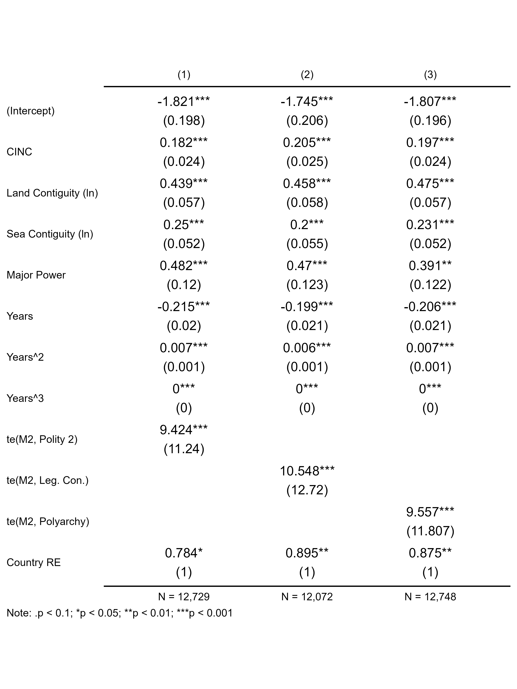
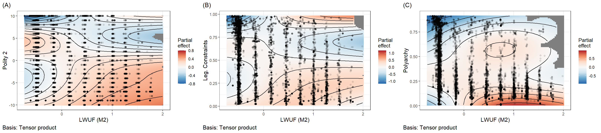

***Keywords***: Leaders, Hawkishness, Constraints, War

\newpage

# Introduction

Do leader attributes or domestic institutions explain why certain countries are more likely than others to initiate international conflicts? The obvious answer is *both*, but few studies consider these explanations in tandem. On the one hand, a new and growing body of research finds that leader attributes, interests, and psychological traits contribute to hawk bias and, by extension, predict greater risk of international conflict initiation [see @carter2024leader for a recent summary]. On the other hand, a much larger and long-standing literature on regime type, comparing democracies with autocracies and, within the latter, personalist with non-personalist regimes [@weeks2012strongmen], finds that regime characteristics matter for international conflict initiation, too. This study combines insights from both of these literatures by proposing that leader attributes and regime characteristics interact in significant ways that contribute to the chance of war. As will be shown, the empirical evidence supports this argument.

The idea that both leaders and institutions matter for international conflict may seem intuitive, perhaps even a given, but a systematic empirical study to verify this idea has been difficult to pull off. However, with recent advances in the cross-country measurement of leader characteristics, this is no longer true. Thanks to comprehensive data collection efforts by @ellisetal2015lead and @goemansetal2009ia, researchers can now access vast repositories of leader backgrounds, political leanings, and psychological traits. Advancing the field even farther, @carter2020framework recently devised a latent measure of leader hawkishness (or more precisely, leader willingness to use force) on the basis of the data generated by @ellisetal2015lead and @goemansetal2009ia using Bayesian item response theory (IRT). This novel measure possesses compelling face validity, performing comparatively well in regression models predicting conflict initiation relative to models that use leader characteristics and psychological traits as independent predictors [@carter2020framework]. It further performs well in predicting conflict-adjacent foreign policy behaviors, such as military expenditures [@carter2024leader]. These data advances offer an opportunity to assess the interaction between a leader's hawk bias and regime characteristics with far more tractability and comprehensive coverage than was previously possible.

Using Carter's [-@carter2020framework] latent measure of leader willingness to use force and alternative measures of institutional constraints on country executives, results from the empirical analysis show that both leader willingness to use force and institutional constraints jointly predict the chance that countries initiate international conflicts. Logit models that predict the likelihood of conflict initiation at the leader-year level of analysis from 1875 to 2004 based on the interaction between willingness to use force with the intensity of executive constraints using semi-parametric smoothers (while controlling for military capabilities, contiguity, peace spells, and random country effects to adjust for within country dependence and between country heterogeneity) show that leader willingness to use force only predicts an increase in the chance of a country initiating an international conflict when institutional constraints are limited.

This finding contributes, and offers important refinements, to the growing quantitative literature on the role of leaders in conflict initiation, and the well-established literature on regime type's role in the same. With respect to the former, this study shows, consistent with @carter2020framework, leaders that are more willing to use military force often do. However, the institutional context matters as well. Leader willingness to use force only translates into an increased probability of conflict initiation when constraints on executive authority are limited.

With respect to the latter body of work, this study shows that regimes with limited executive constraints are also more prone to initiating international conflicts. However, a personalist regime is insufficient. A leader must have a high baseline willingness to use military force to begin with. Unconstrained leaders with hawk bias pose the most serious threat to international peace.

The rest of the paper proceeds as follows. First, this study is motivated with an overview of the literature on leader attributes and regime type as predictors of conflict initiation. While both literatures offer plenty of insights, precious little work has considered how both leaders and institutional contexts interact. Second, the theoretical argument is laid out in greater detail. The role of leaders and institutions is couched in the bargaining model of war and principal-agent theory, and the argument is made that leaders with high willingness to use force have narrower bargaining ranges for war. As a result, leaders with limited constraints on their authority are more prone to initiating international conflicts because they don't have to answer to others in government or society that bear more of the costs of war. Third, the data and methods used to test this argument are presented. Fourth, the results of the analysis are shown. Finally, the paper concludes with a discussion of implications, limitations, and fruitful extensions.

# Motivation

Two broad bodies of research offer competing explanations for why some countries are more prone to starting international conflicts than others. The first emphasizes the role of individual leaders. A growing line of quantitative work finds that leader attributes—including their political backgrounds, psychological traits, and risk tolerance—shape foreign policy behavior in consequential ways [@ellisetal2015lead; @goemansetal2009ia; @carter2020framework]. Leaders, in short, are not interchangeable. A state led by a risk-acceptant, militaristic executive is simply more likely to pick a fight than one led by a cautious, conflict-averse counterpart. The implication is that understanding who leads a country says something meaningful about what that country will do on the world stage.

The second body of work emphasizes regime type and domestic institutions. Variants in this body of work include the vast literature on the democratic peace, while more recent contributions refine this claim by distinguishing among types of autocracy, showing that personalist regimes, in which power is concentrated in the hands of a single unconstrained executive, are especially conflict-prone [@weeks2012strongmen]. The mechanism is straightforward: leaders who face few institutional checks, such as no legislature to defund a war, no judiciary to constrain mobilization, and no selectorate to punish adventurism at the polls, bear fewer political costs when they choose to use force. Institutions, on this view, put the brakes on belligerence.

Both literatures are compelling, yet they largely talk past each other, as @carter2024introduction notes in a recent introduction to a special issue on the topic of leader attributes and peace science. Studies of leader attributes rarely model how institutional constraints might condition their effects. Studies of regime type rarely ask whether the personality and predispositions of the leader at the top matter above and beyond the structural features of the regime. This is an important omission. If the effect of leader hawkishness depends on the institutional environment in which a leader operates, then models that gloss over this interaction will produce an incomplete picture of what's going on.

The present study fills this gap. Rather than treating leaders and institutions as rival explanations, it treats them as jointly necessary conditions for understanding conflict initiation. The argument, developed formally in the next section, is that hawkish leaders are dangerous precisely when they face limited constraints. When institutional checks are strong, even a leader inclined toward force can be restrained. When they are weak, that same inclination translates directly into aggressive foreign policy. The combination of hawk bias and unconstrained executive authority is what poses the most serious threat to international peace.

# Theoretical Argument

The argument developed here integrates the bargaining model of war [@fearon1995rationalist] with principal-agent theory to explain how leader attributes and institutional constraints jointly shape the probability of conflict initiation. The core claim is simple: hawkish leaders have systematically narrower bargaining ranges, and limited institutional constraints allow those preferences to be acted upon without correction.

In the canonical bargaining model of war, conflict is costly and inefficient [@fearon1995rationalist]. Rational leaders should, in principle, always prefer a negotiated settlement to a costly gamble at war. Yet wars happen. The standard explanations focus on informational asymmetries, commitment problems, and issue indivisibility. This study adds a preference-based mechanism: leader willingness to use force.

This idea is one of the central themes in Christopher Blattman's [-@blattman2023we] recent book, *Why We Fight*, in which he offers a sweeping framework for understanding various theoretical arguments for why wars occur. When it comes to leader characteristics in particular, @blattman2023we argues that a leader with a high baseline willingness to use force perceives the costs of war as comparatively low, or, alternatively, perceives the potential gains from conflict as especially high. Either way, the effect on the bargaining range is the same: it narrows. As a leader's willingness to use force increases, the set of negotiated outcomes the leader finds preferable to war shrinks. This makes bargaining breakdown more likely because the leader genuinely prefers the prospect of conflict to a wider range of diplomatic settlements. Hawkish leaders, in short, are harder to satisfy at the bargaining table.

Blattman's [-@blattman2023we] summary of this argument doesn't stop here. He goes on to explain that leader preferences do not translate directly into state behavior. Leaders operate within institutional environments that may amplify or attenuate their preferences. This is where principal-agent theory enters the picture.

Executives can be understood as agents of a broader set of domestic principals such as legislatures, parties, or citizens. These are groups who bear a disproportionate share of the costs of war. When institutional constraints are strong, these principals have the tools to monitor, discipline, and override hawkish executives. Legislative bodies may refuse authorizations for the use of force, deny military appropriations, or credibly threaten removal. Public accountability mechanisms may deter leaders from initiating conflicts that impose large costs on the population. In short, strong constraints create a domestic audience whose preferences moderate the leader's own.

When institutional constraints are weak, however, the principal-agent relationship breaks down. Unconstrained executives need not obtain legislative approval, are insulated from electoral punishment, and can suppress or ignore opposition. In such environments, the leader's own preferences dominate state behavior. A hawkish leader in a constrained institutional environment may be blocked from acting on those preferences; the same leader in an unconstrained environment faces no such barrier.

This logic generates a clear, testable prediction. Because hawkish leaders have narrower bargaining ranges, and because unconstrained executives can act on their preferences without domestic constraints, the probability of conflict initiation should be highest at the intersection of high leader willingness to use force and low institutional constraints on the executive. More formally:

> **H1**: *Leader willingness to use force will predict a higher probability of conflict initiation when institutional constraints on the executive are limited, but not when such constraints are strong.*

A secondary implication follows as well. The absence of institutional constraints alone, in the absence of hawkish preferences, should not substantially increase conflict risk. A constrained but dovish leader has little appetite for war to begin with. The lack of constraints becomes consequential in the presence of hawkish leaders.

> **H2**: *The absence of constraints will predict a higher probability of conflict initiation when leaders have high willingness to use force.*

Together, these hypotheses frame conflict initiation in terms that align with Braumoeller's [-@braumoeller2003causal] Boolean framework for hypothesis testing. Leaders are predicted to initiate international conflicts when they have high willingness to use force AND when constraints on their ability to do so are limited.

This requires paying special attention to statistical methods, as a conventional parametric interaction model is ill-suited to testing this kind of conditional relationship. The next section describes the data and methods that will be used to appropriately test these predictions.

# Data and Methods

## Outcome Variable

The dependent variable is conflict initiation at the leader-year level of analysis. A leader-year is coded as 1 if the country initiated at least one militarized interstate confrontation (MIC) in a given year, and 0 otherwise. MIC initiation data are drawn from version 1.0 of the Militarized Interstate Events Dataset, which provides coverage on international conflicts from 1816 to 2014[@gibler2024militarized].

The leader-year is the appropriate unit of analysis for this study. Because the theoretical argument is about how individual leader preferences interact with institutional environments, the analysis must be situated at a level of analysis that captures variation in both over time within countries and across leaders. Annual leader-year observations accomplish this. To construct the dataset, the `{peacesciencer}` R package was used [@peacesciencer-package], which draws on the Archigos dataset of political leaders from 1870 to 2015 [@goemansetal2009ia]. To ensure that MIC initiations were appropriately matched to leader-years rather than country-years, a leader-day level dataset was first constructed, and then start dates for MICs were then matched to the tenures of individual leaders. For example, if leader A of a country left office mid-year, and then leader B of that country initiated a conflict later in the year, the MIC initiation is attributed to B and not A. If merging the data by country years (which is the more conventional way to study conflict data), the conflict initiation would be falsely attributed to both leaders since they both held office in the same year. To further ensure appropriate merging, the leader data was standardized with Correlates of War country codes to match the conflict dataset. Once conflicts were successfully matched to leaders, the data was then aggregated to the leader-year level.

## Key Explanatory Variables

*Leader willingness to use force* is the first key independent variable. The primary measure of leader hawkishness is the latent willingness-to-use-force score developed by @carter2020framework. Specifically, measure M2 was used, which was the best performing measure of the four created by @carter2020framework for predicting conflict on the basis of latent leader hawkishness. This measure is derived via Bayesian item response theory (IRT) applied to leader background characteristics drawn from @ellisetal2015lead and @goemansetal2009ia, specifically a cluster of factors linked to leader backgrounds, political orientation, and psychological traits. The resulting scores capture a leader's latent propensity to use military force, independent of the strategic context. Higher values indicate greater willingness to use force. The measure is referred to throughout as M2, following @carter2020framework's notation.

*Executive constraints* are the second explanatory variable. Three alternative measures of institutional constraints on executives are used to assess the robustness of results. The first is the Polity 2 score from the Polity 5 dataset, which captures a country's regime type on a continuum from -10 to +10 [@marshall2020polity5]. While not only a measure of executive constraints, compared to many alternative democracy measures, Polity 2 is well-known for its unique focus on chief executives in quantifying quality of democracy. In particular, it emphasizes executive recruitment, selection, and constraints in assessing regimes. Polity 2, therefore, is closely aligned with the concept of executive constraints argued to condition the impact of leader willingness to use force.

The second measure is V-Dem's legislative constraints index (`v2xlg_legcon`), which captures the degree to which the legislature can effectively constrain the executive branch [@maerz2022vdemdata; @coppedge2025vdem]. In particular, it is meant to capture the extent to the legislature and government agencies question, investigate, or exercise oversight over the executive. The measure takes values from 0 to 1, where 0 means no legislative constraints exist and 1 means maximum legislative constraints exist. Unlike Polity 2, this measure offers a more targeted assessment of executive constraints, while still offering substantial variation in cross-country scores.

The third is V-Dem's Polyarchy index, a composite measure of liberal democracy that encompasses electoral, civil society, and rule of law dimensions [@maerz2022vdemdata; @coppedge2025vdem]. This measure is much broader in its evaluation of institutions, which offers a chance to assess whether executive constraints narrowly, or features of liberal democracy more broadly, act as a check against hawkish leaders.

Using all three measures allows the analysis to assess whether results are sensitive to the conceptualization of institutional constraints. While all three are strongly correlated with each other, they diverge in some significant ways. This makes it possible that choice of measure could determine the outcome of the analysis. Using all three should help to mitigate this concern and identify possible scope conditions on what constraints matter.

## Control Variables

The models include a standard set of controls for conflict research. Military capabilities are measured using the Composite Index of National Capability (CINC) score [@singer1987rcwd; @singeretal1972cdu]. Major power status is included as a binary indicator [@cowstates2016]. The number of land and sea contiguous borders is included to account for conflict opportunities [@stinnettetal2002cow]. Peace spells are modeled with cubic polynomial terms for the number of years since a country's last conflict initiation, following standard practice for dealing with temporal dependence in binary time-series cross-section data. This measure was constructed on the basis of MIC initiations using tools available with the `{peacesciencer}` package and the `{spduration}` package [@peacesciencer-package; @spduration-package].

## Estimation Strategy

Models are estimated using logit with semi-parametric two-dimensional smoothers to capture the non-linear interactive relationship between leader willingness to use force and executive constraints. This choice is based on the advice of @hainmueller2019much who convincingly caution against the use of multiplicative interaction terms and make the case for using generalized additive models (GAMs) instead. The use of semi-parametric smoothers avoids imposing a parametric functional form on interactions, allowing the data to reveal the shape of the relationship without prior constraints.

This choice is particularly important for testing the logical "AND" implied by hypotheses 1 and 2 proposed in the theoretical discussion. The argument proposed here is that conflict initiation occurs with the highest probability at the intersection of high leader willingness to use force and low executive constraints. Such a hypothesis is not well-tested with a simple multiplicative interaction. This is the problem for which @braumoeller2003causal developed Boolean logit models, but it is also easily dealt with using a joint non-linear smoother on continuous predictor variables. The approach used here relies on the tensor product smoothers proposed by @wood2006low, and it was implemented using R's `{mgcv}` package.

Country-level random effects are also included in model estimation to account for within-country temporal dependence and between-country heterogeneity. Three models are estimated, one for each measure of executive constraints, and results are compared across specifications to assess robustness. The below specification represents the generic formulation applied to all three models:

$$
\Pr(\text{MIC}_{lit} = 1) = \Lambda[\text{te}(\text{M2}_{lit}, \text{const}_{it}) + \beta X_{it} + \alpha_i + \text{p}(\text{years}_{it})]
$$

The outcome is the probability that the leader $l$ of country $i$ initiates a MIC in year $t$. The $\Lambda()$ represents the logistic transformation. $\text{te}()$ represents the tensor product of leader willingness to use force (M2) and one of the measures of executive constraints. $X_{it}$ is a vector of control variables, $\alpha_i$ is country random intercepts, and $\text{p}()$ represents a cubic polynomial transformation on peace years.

# Analysis

Table 1 reports logit model results. For all control variables, entries are coefficients, with standard errors included in parentheses. For smoothed terms and country random effects, entries are effective degrees of freedom and residual degrees of freedom in parentheses. Statistical significance for the latter is approximate significance based on a $\chi$-squared test.

Estimates for control variables are consistent with what you would expect. All are positive and statistically significant. Military power, major power status, and having a greater number of land and sea contiguous borders all predict a higher chance that a leader initiates a conflict with another country. All terms for cubic peace years are also statistically significant. Further, the random country effects are also significant, implying that modeling within-country dependence and between-country heterogeneity is absorbing meaningful variation in conflict initiation in the data.

Also encouraging, all of the two-dimensional smoothers that interact leader willingness to use force (M2) with measures of leader constraints are statistically significant. This implies that leader willingness to use force and regime characteristics jointly predict conflict initiation. However, this finding alone fails to show whether the relationship is consistent with the theoretical argument that leader willingness to use force predicts greater conflict initiation conditional on limited executive constraints. Only generating model predictions will show whether the relationships move in the expected direction.

Figure 1 shows the relevant conditional predictions from each of the three logit models presented in Table 1, and the results are consistent with the theoretical argument: greater willingness to use force predicts a higher probability of conflict initiation when constraints are limited. Panel A shows predictions from Model 1, B from Model 2, and C from Model 3. The x-axis shows leader willingness to use force, and the y-axis shows the predicted probability of conflict initiation. Predictions include 83.4% confidence intervals which provide appropriate coverage for judging statistical significance based on the non-overlap of confidence intervals. In the first panel, Polity 2 was used as a proxy for political constraints, in the second V-Dem's legislative constraints index was used, and in the third V-Dem's full democracy index (Polyarchy) was used. For the first, Polity 2 values of -5 and +5 were used to generate conditional predictions, and for the other two, values of 0.25 and 0.75 were used. When constraints are measured using both Polity 2 and legislative constraints, the results strongly support the argument that leader willingness to use force predicts a greater probability of conflict initiation only when leader constraints are limited. Among the most hawkish leaders in the data, those with limited constraints are about twice as likely to initiate an international conflict—an 8% chance versus a 4% chance when Polity 2 scores are +5 or -5, and a 9% chance versus a 4% chance when legislative constraints are 0.75 or 0.25. The results, however, are not so clean when using Polyarchy to measure constraints. Across most levels of leader willingness to use force, there is no statistically significant difference in the probability of conflict initiation conditional on Polyarchy scores.

The weaker results with Polyarchy compared to Polity 2 and legislative constraints is interesting, but also arguably more consistent with the theoretical argument presented here. Both Polity 2 and legislative constraints on executives emphasize restrictions on chief executives, while Polyarchy captures a much broader set of factors linked to liberal democracy. This supports the idea that executive constraints, as opposed to regime type per se, are the chief mechanism moderating leader willingness to use force.

Figure 2 provides another way to understand the results from the two-dimensional non-linear smoother on leader willingness to use force and leader constraints. The results, again, support the theoretical argument. Each panel is a heat map that shows the joint partial effect of leader willingness to use force and leader constraints on conflict initiation. Panel A shows results from Model 1, B from Model 2, and C from Model 3. In the first, where Polity 2 is used as a proxy for leader constraints, the most pronounced hot spot for conflict initiation is at the intersection of high leader willingness to use force (M2 \> 0) and low Polity 2 scores (\< 0). A similar pattern exists when using V-Dem's legislative constraints measure and when using V-Dem's Polyarchy. There are, however, some other curious, albeit smaller, hot spots that show up as well, and in unexpected places.

An important question is whether these hot spots reflect theoretically problematic exceptions, or are the product of measurement error. A quick glance at the data suggests it may be the latter. In Panel A, a notable spike in the chance of conflict initiation emerges at the intersection of negative leader willingness to use force and Polity 2 scores in the 4-5 range. One of the more intense conflicts in this cluster was initiated by Robert Kocharian of Armenia in 2002 against Azerbaijan. Around this time, Kocharian undertook aggressive actions to organize political control under himself. It was a system of government that some activists referred to as a "pyramid of power" with Kocharian at the pinnacle.[^1] Polity 2 likely was too optimistic about the Armenian regime around this time. However, V-Dem's measure of legislative constraints and its Polyarchy Index are not as sanguine in their evaluation of the regime. The latter scores Armenia in 2002 at a 0.407 on its 0-1 scale, and the former scores Armenia even lower, at 0.254. Perhaps it is no coincidence that neither measure generates a hot spot of conflict initiation at a place proportionate to the one that emerges with the Polity 2 index. There may simply be a cluster of cases in the data with inappropriately high Polity 2 scores in the 4-5 range that the other measures better capture.

[^1]: See "The Kocharian Legacy: Turbulent Beginning, Violent End." Accessed March 14, 2026: <https://agbu.org/armenia-georgia/kocharian-legacy-turbulent-beginning-violent-end>.

Curiously, for this same case, Kocharian also has a low latent score for willingness to use force, as do other leaders in this same hot spot. This is harder to explain away, but as @carter2020framework caution, their measure is only an estimate based on background factors linked to risk taking, political orientation, and psychological characteristics. It isn't guaranteed to capture willingness to use force perfectly. However, this may be too convenient an explanation, and one that undermines the validity of the measure.

An alternative explanation is a possible confounder, namely, the geostrategic context. Armenia's rivalry with Azerbaijan is the obvious elephant in the room for this particular case. Both countries share well-known animosity, and a leader like Kocharian seeking to consolidate power might see initiating a conflict with a rival country as beneficial for his own domestic goals. This explanation is far more interesting, because it points toward additional domestic (power consolidation) and geostrategic (rivalry) factors that may explain why leaders behave as hawks, perhaps independent of willingness to use force.

Such exceptions aside, the analysis overall supports the theoretical argument laid out in this paper. Willingness to use force predicts a higher chance that leaders initiate international conflicts, but only when domestic constraints on leaders are limited.

# Conclusion

This study set out to examine whether leader attributes and domestic institutions jointly predict international conflict initiation, and the results suggest they do. Drawing on Carter's [-@carter2020framework] latent measure of leader willingness to use force and three alternative measures of executive constraints, the analysis demonstrates that hawkish leaders are significantly more likely to initiate conflicts, but only when institutional checks on their authority are limited. When constraints are strong, even leaders with high willingness to use force appear unable or unwilling to translate their preferences into aggressive action. It is the combination of hawk bias and unconstrained executive power that poses the most serious threat to international peace.

These findings carry several implications. For the literature on leader effects in conflict, this study shows that individual attributes cannot be understood in isolation from the institutional environments in which leaders operate. Studies that model leader attributes without accounting for institutional context risk overstating or understating the influence of individual leaders on foreign policy.

For the literature on regime type and conflict, the results offer a complementary refinement. It is not enough to observe that personalist or weakly constrained regimes are more conflict-prone. The conflict propensity of such regimes depends, at least in part, on *who* leads them. An unconstrained executive without hawkish preferences may be no more dangerous than a constrained one. The risk associated with institutional weakness is conditional on the nature of the leader at the top. This suggests that future work on regime type and conflict would benefit from incorporating leader-level measures more systematically.

Some limitations with this analysis are, however, worth noting. First, the latent measure of willingness to use force, while carefully constructed, is an estimate rather than a direct observation. As @carter2020framework acknowledge, the measure may misclassify individual leaders, and the analysis of cases like Kocharian suggests that geostrategic context and domestic power consolidation may generate conflict-initiating behavior that the measure does not fully capture. Second, the three measures of executive constraints used here tap into related but distinct concepts, namely, regime type, legislative oversight, and liberal democracy more broadly. The results vary accordingly. The weaker findings for Polyarchy suggest that the mechanism is specifically about executive constraints rather than regime type writ large, but this conclusion rests on a contrast across specifications rather than a direct test of the causal pathway. Third, the analysis is limited to conflict initiation and does not speak to conflict escalation, duration, or outcomes.

Future research could extend this work in several directions. The most promising avenue would be to examine whether the interaction between leader hawkishness and institutional constraints extends beyond conflict initiation to other domains of foreign policy, including alliance formation, trade disputes, and sanctions. @carter2024leader's recent work on military expenditures suggests that the willingness-to-use-force measure has predictive reach beyond the initiation of formal militarized disputes, and it would be valuable to know whether institutional constraints similarly moderate these effects. A second extension would incorporate rivalry and geostrategic context more explicitly, both to address the confounding illustrated by the Kocharian case and to test whether the domestic mechanism identified here operates independently of external threats. Finally, improving measurement of executive constraints, particularly in hybrid regimes where formal institutions exist but may not function as advertised, would strengthen the inferences that can be drawn from this and related analyses.

In sum, this study finds that leaders and institutions are not rival explanations for international conflict initiation; they are jointly necessary ones. Unconstrained hawks initiate wars. Constrained hawks, by and large, do not.

# Supplementary Materials

Replication materials for this analysis can be found on the author's GitHub: <https://github.com/milesdwilliams15/leaders-unleashed>

# References
