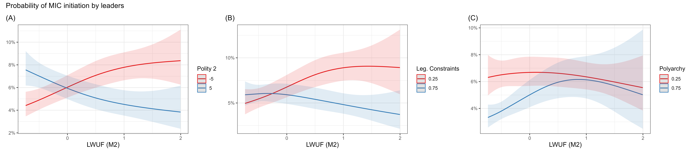

## Hawks and Constraints Both Drive Conflict Initiation

- Two literatures explain conflict initiation:
  - **Leader attributes**: hawkishness, risk tolerance, psychological traits [@carter2020framework; @ellisetal2015lead]
  - **Regime type**: personalist vs. constrained regimes [@weeks2012strongmen]
- These literatures largely talk past each other [@carter2024introduction]
- This study asks: do leader attributes and institutional constraints **interact** to predict conflict?

## Unconstrained Hawks Are the Greatest Threat to Peace

**Preview of findings:**

- Leader willingness to use force predicts conflict initiation, but only when domestic constraints are weak
- The combination of hawk bias + unconstrained authority is most dangerous

---

## Hawkish Preferences Narrow the Bargaining Range

- In the bargaining model of war [@fearon1995rationalist], wars are inefficient; leaders prefer negotiated settlements
- Leaders with high willingness to use force perceive war's costs as low or its gains as high [@blattman2023we]
- Result: their bargaining range narrows → more likely to reject diplomatic settlements

## Unconstrained Executives Act on Hawkish Preferences

- Principal-agent theory: legislatures, parties, and citizens bear costs of war
- Strong constraints → principals can block, defund, or punish hawkish executives
- Weak constraints → leader preferences dominate state behavior

## Greatest Threat at Intersection of Hawk Bias and Weak Constraints

**Hypotheses:**

- **H1**: Willingness to use force predicts conflict initiation only when constraints are limited
- **H2**: Lack of constraints predicts conflict only when leaders are hawkish

These hypotheses imply a Boolean "AND" [@braumoeller2003causal]

---

## Data on 130 Years of Leader-Year Observations

- **Unit of analysis**: leader-year (1875–2004)
- **Outcome**: MIC initiation [@gibler2024militarized], matched to individual leaders via Archigos [@goemansetal2009ia]
- **Key predictors**:
  - Leader willingness to use force: latent IRT measure M2 [@carter2020framework]
  - Executive constraints: Polity 2 [@marshall2020polity5], V-Dem Legislative Constraints (`v2xlg_legcon`), V-Dem Polyarchy [@coppedge2025vdem]
- **Controls**: CINC score, major power status, contiguous borders, cubic peace years
- **Estimation**: Logit with tensor product smoothers [@wood2006low; @hainmueller2019much] + country random effects

## Non-Parametric Smoothers Capture the Conditional Relationship

**Model Specification:**
$$
\text{Pr}(\text{MIC}_{lit} = 1) = \Lambda[\text{te}(\text{M2}_{lit}, \text{const}_{it}) + \beta X_{it} + \alpha_i + \text{p}(\text{years}_{it})]
$$

- Tensor product smoothers avoid imposing a parametric functional form on the interaction [@hainmueller2019much]
- Suited to testing the logical "AND" of H1 and H2 [@braumoeller2003causal]
- Three models estimated—one per constraint measure—to assess robustness

---

## Hawkish Leaders with Weak Constraints Initiate More Conflicts

- When constraints are low, the most hawkish leaders have ~8–9% probability of initiating conflict
- When constraints are high, that probability falls to ~4%
- Results hold for Polity 2 and Legislative Constraints; weaker for Polyarchy
- Suggests the mechanism is specifically about **executive constraints**

---

## Unconstrained Hawks Initiate Wars; Constrained Hawks Do Not

- **Main finding**: Leader willingness to use force and executive constraints jointly predict conflict initiation
- Neither alone is sufficient; both are necessary
- Executive constraints specifically—not regime type broadly—are the key moderating mechanism

## Limitations and Future Directions

**Limitations**:

- Latent M2 measure is an estimate; may misclassify some leaders (e.g., Kocharian/Armenia mentioned in paper)
- Results vary across constraint measures; no direct test of the causal pathway
- Limited to conflict *initiation*; escalation and other outcomes not addressed

**Future directions**:

- Extend to alliance formation, trade disputes, sanctions [@carter2024leader]
- Incorporate rivalry and geostrategic context
- Improve measurement of constraints in hybrid regimes

## References {.allowframebreaks}

::: {#refs}
:::